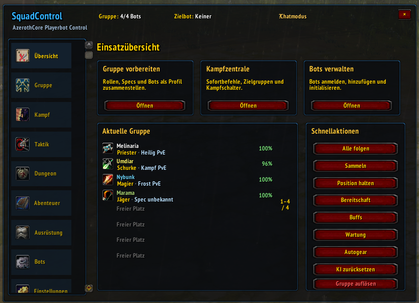
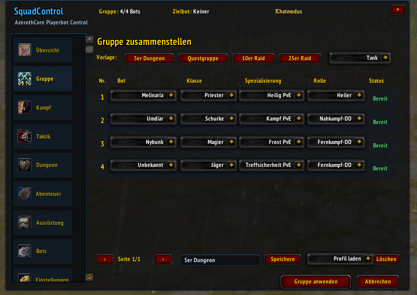
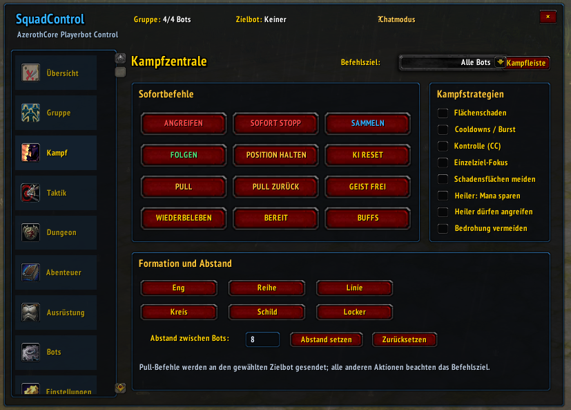
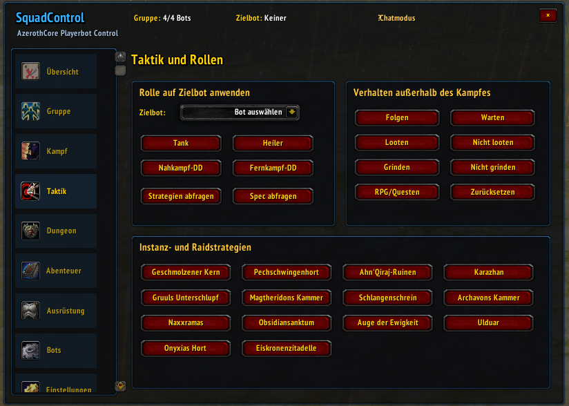
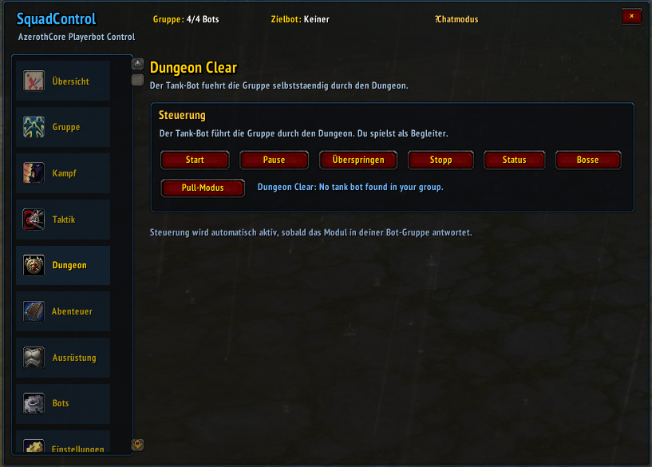
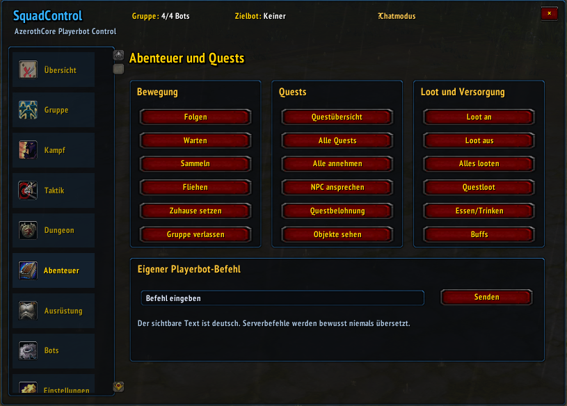
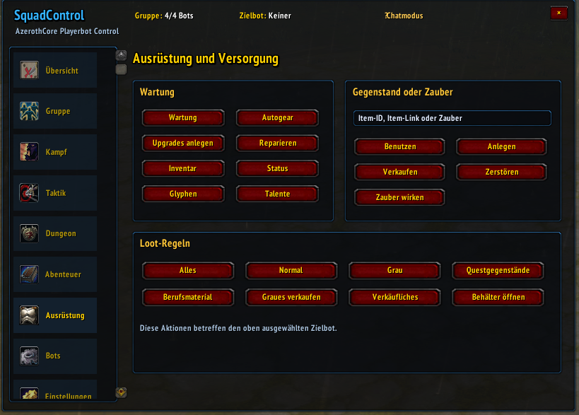
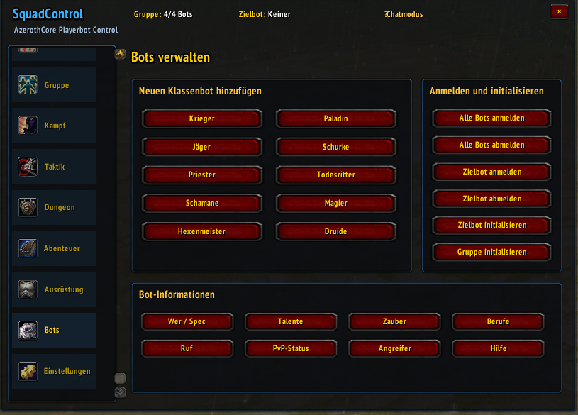
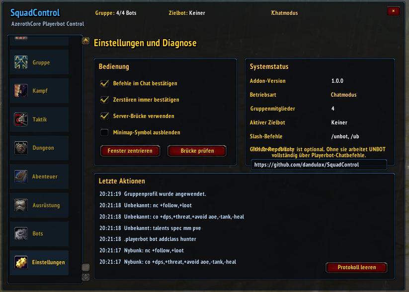
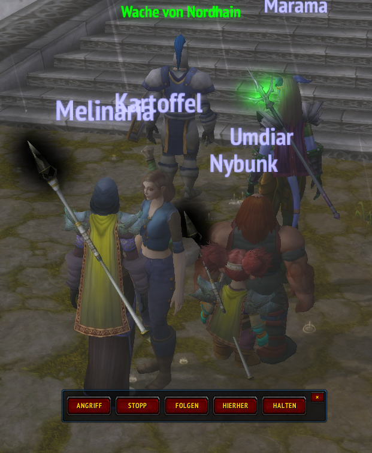

# SquadControl

**SquadControl** is an in-game control addon for the [AzerothCore Playerbot module](https://github.com/mod-playerbots/mod-playerbots). It gives players a clear interface for commanding, managing, and coordinating their Playerbot squad without having to remember every chat command.

> **Project status:** SquadControl is under active development. The available controls can change between releases; the server always remains the authority for Playerbot behavior.

## What it is for

The AzerothCore Playerbot module allows a realm to provide AI-controlled characters. SquadControl is the player-facing addon layer for that module: it turns supported Playerbot actions into discoverable in-game controls while leaving the authoritative bot logic on the server.

SquadControl does **not** create, replace, or modify Playerbots on its own. It requires a server running the Playerbot module and only exposes features that the server has enabled.

## Core capabilities

- Build and save squad setups with class, specialization, and role choices.
- Select individual bots or act on the entire group.
- Use quick controls for combat, follow, stay, summon, recovery, and supported group actions.
- Manage tactics, formations, strategies, equipment, and bot inventory where the realm permits it.
- Detect a compatible Dungeon Clear module automatically and expose its controls only when the module is available on the realm.
- Use safeguards and confirmations for destructive inventory actions.
- Access diagnostics and addon settings, including display and minimap controls.
- Use a localization-ready interface designed to keep visible text separate from server command payloads.

## Screenshots

| 1 | 2 |
| --- | --- |
|  |  |
|  |  |
|  |  |
|  |  |
|  |  |

## Requirements

- World of Warcraft **3.3.5a** client.
- An AzerothCore realm with the [Playerbot module](https://github.com/mod-playerbots/mod-playerbots) installed, enabled, and configured.
- A player account allowed to use the relevant Playerbot features on that realm.

Server configurations differ. A button can only work when its corresponding Playerbot capability and command are enabled by the server administrator.

### Optional [Dungeon Clear](https://github.com/jrad7/mod-dungeon-clear) support

SquadControl automatically checks whether the [mod-dungeon-clear](https://github.com/jrad7/mod-dungeon-clear) module is available on the realm. When it is detected, the related controls become available in the addon. If the module is not installed, disabled, or incompatible, SquadControl continues to work normally without showing unsupported Dungeon Clear actions.

## Installation

1. Download the latest SquadControl release from the repository's **Releases** page.
2. Extract the archive into your World of Warcraft AddOns directory:

   ```text
   World of Warcraft/Interface/AddOns/
   ```

3. Confirm that the resulting folder is named `SquadControl` and contains the addon's `.toc` file directly inside it.
4. Start the game and enable **SquadControl** on the character-selection AddOns screen.
5. Log in to a realm that runs the AzerothCore Playerbot module.

If you install from source during development, copy the repository contents into `Interface/AddOns/SquadControl` and reload the game UI after updates.

## Language support

SquadControl is designed to read the language of the WoW client automatically and load matching visible text where a localization is available. No manual language selection should be necessary.

- Supported translations will be listed here as they are released.
- If a translation is not available, the addon falls back to English.
- Only interface text is localized. Playerbot command strings are kept exactly as required by the AzerothCore Playerbot module, so localization does not alter server-side behavior.

## Usage

Once installed, open SquadControl through its in-game entry point or configured key binding. Select a Playerbot or squad action, review any confirmation prompt, and let SquadControl send the supported request to the Playerbot module.

The exact available actions depend on the server configuration and on the version of the Playerbot module in use. Realm administrators may disable particular commands or features.

## For realm administrators

SquadControl is a client addon. Install and configure the AzerothCore Playerbot module on the realm first; then distribute SquadControl to players as an optional UI for the capabilities you choose to expose.

Before publishing the addon to your players, verify the following on a test realm:

- The target Playerbot commands are enabled and safe for player use.
- Permission rules prevent access to administrative-only commands.
- The configured addon actions use the exact command syntax expected by your Playerbot-module version.
- The intended client locales display correctly, including the English fallback.

## Development

The project is written as a standard WoW 3.3.5a Lua addon. Contributions are welcome once the initial structure is in place.

When adding a feature:

1. Keep command payloads separate from user-facing strings.
2. Add or update the English text first, then provide translations where possible.
3. Avoid exposing Playerbot commands that the server does not explicitly support.
4. Test with a real AzerothCore Playerbot realm before submitting changes.

## Contributing

Bug reports, feature requests, translations, and pull requests are welcome. Please include the following with any Playerbot-related issue:

- SquadControl version or commit.
- WoW client locale.
- AzerothCore and Playerbot-module version.
- Steps to reproduce the issue.
- Relevant Lua errors or server-side command output, with private information removed.

## License

SquadControl is licensed under the [GNU General Public License v3.0](LICENSE).

Copyright (c) 2026 dandulox.
